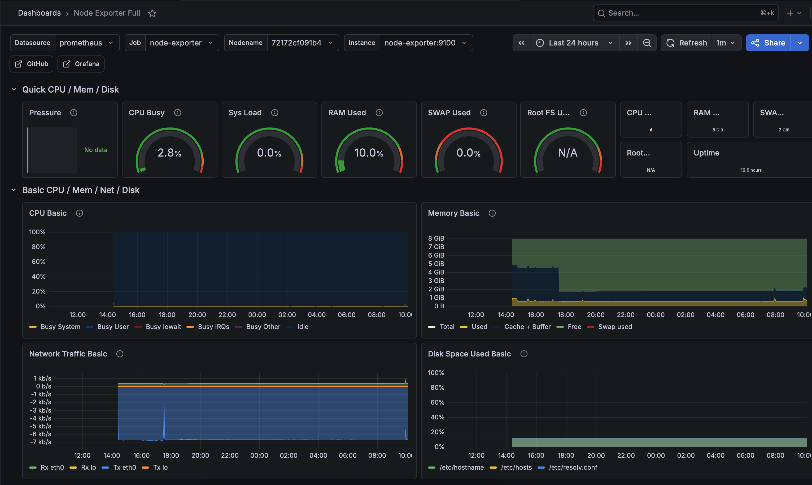

# Home Lab

This repo contains source code that supports an integrated network monitoring stack. We'll run the concurrent Docker services on a Raspberry Pi 5:

* `Prometheus` scrapes hardware and network metrics in real time
* Similarly, the `Speedtest Exporter` service runs every few hours to regularly collect upload / download speeds
* `Grafana` is used as the dashboarding service on top of the scraped Prometheus data

